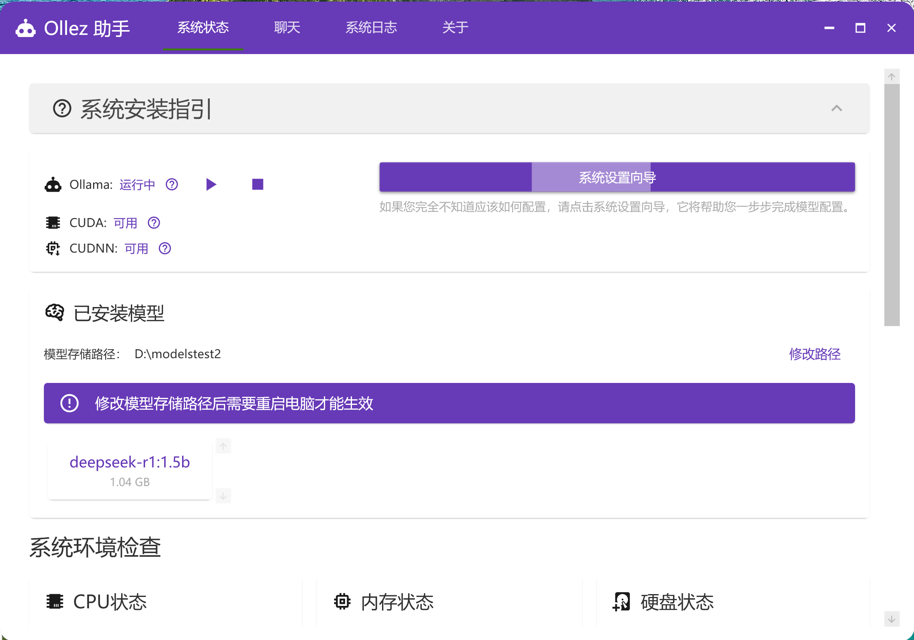
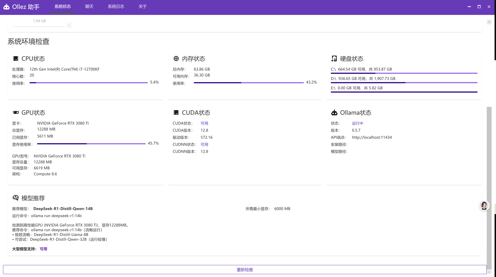
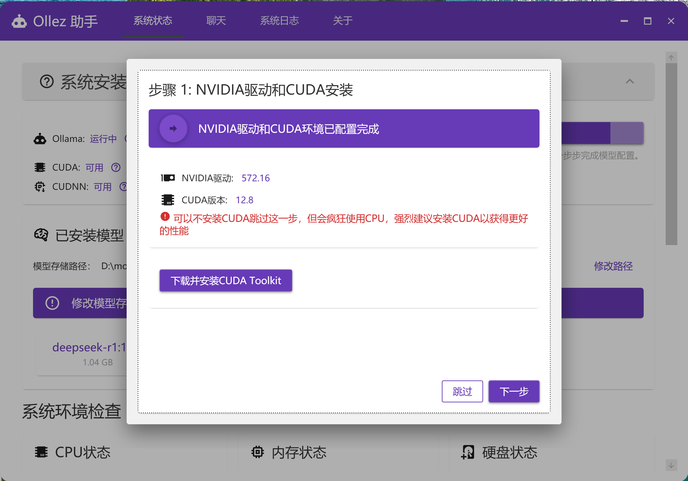
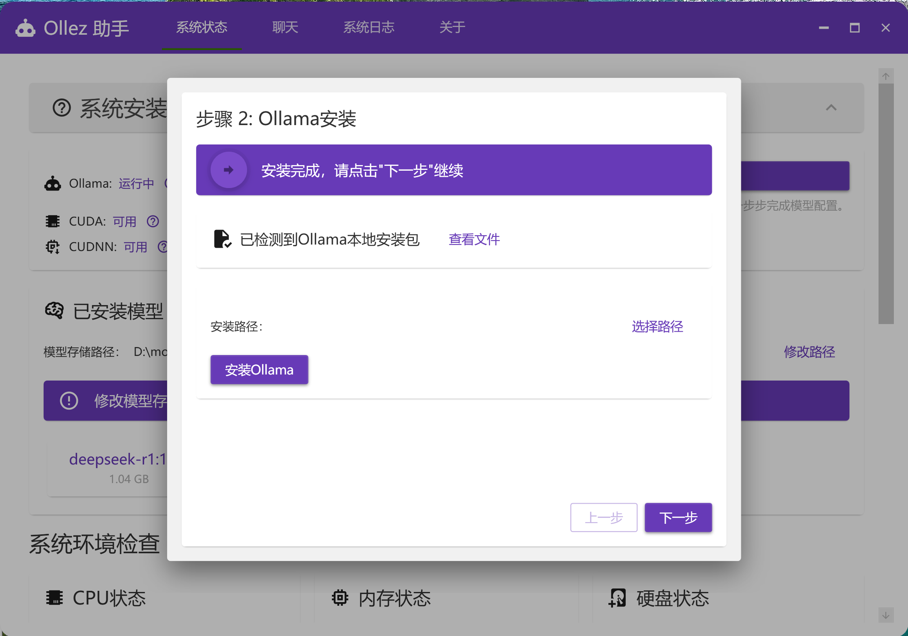
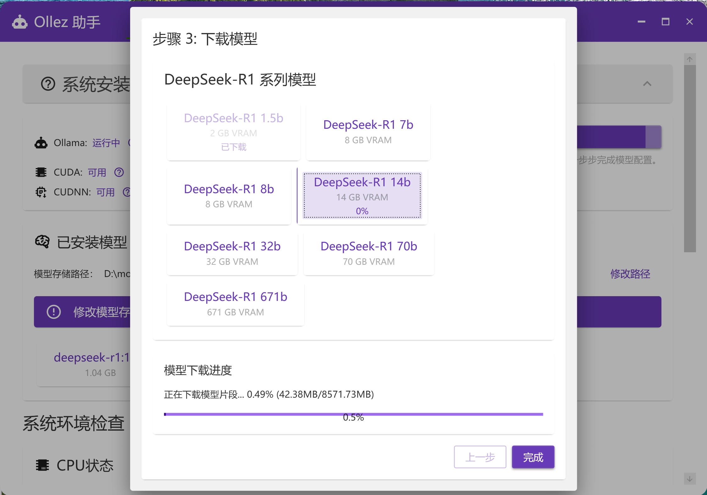

Ollez 助手

Ollez 助手是一个专门为 Ollama 设计的图形界面管理工具。它能帮助用户轻松管理和使用各种大语言模型，特别是 DeepSeek 系列模型。本工具提供了系统环境检查、模型管理、对话交互等功能，让用户能够更便捷地使用 AI 模型。

## 主要功能

- 🖥️ **系统环境检查**
  - CUDA 环境检测
  - GPU 硬件信息监控
  - 系统资源使用状态监控
  - Ollama 运行状态检查

- 🤖 **模型管理**
  - 自动推荐适合用户硬件的模型
  - 模型下载和安装
  - 已安装模型管理
  - 模型运行状态监控

- 💬 **对话交互**
  - 支持多会话管理
  - 实时对话流式响应
  - 历史记录保存
  - 会话内容导出

## 技术特性

- 基于 WPF 开发的现代化界面
- 采用 Material Design 设计风格
- MVVM 架构设计模式
- 主要依赖：
  - Prism.DryIoc - MVVM框架和依赖注入
  - MaterialDesignThemes - Material Design风格UI组件
  - Serilog - 结构化日志记录
  - CommunityToolkit.Mvvm - MVVM工具包

## 系统要求

- Windows 7 及以上操作系统
- .NET Framework 运行时
- NVIDIA GPU（推荐，但不强制）
- Ollama 运行环境

## 开源协议

本项目采用 MIT 开源协议。您可以自由使用、修改和分发本软件，但需要保留原始版权声明和许可声明。

## 步骤

1. 下载安装包
2. 解压安装包
3. 运行 `Ollez.exe`
4. 按照提示安装 NVIDIA 驱动和 CUDA
5. 安装完成后，运行 `Ollez.exe`

## 作者信息

- 作者(dy)：凶残的朱哥
- 作者(破小站)：破壁人neptune
- 邮件：laozhu_shangxin@hotmail.com
- 源码：https://github.com/hubeizys/olez 
